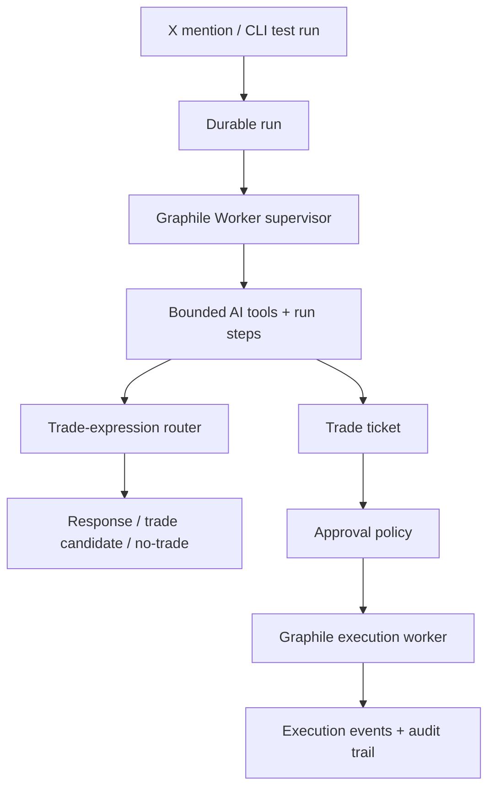

# Cassie

Cassie is an X-native trade-expression and ticketing agent. A mention or CLI test run creates a durable run, a Graphile Worker supervisor drives bounded AI tools, and approved trade tickets are handed to the execution worker.

Cassie can reason with AI, but she does not directly place orders.

## Agent Architecture



Runtime shape:

- Intake is durable first: every mention or CLI test becomes a `control_run` before the supervisor starts.
- The supervisor drives the run: it calls bounded tools and writes visible `run_steps`.
- Cassie treats the source post as raw verifiable signal, frames the opportunity, generates trade expressions, searches supported venues, ranks the cleanest real expression, and finalizes a ticket or no-trade.
- DeepSeek handles cheap extraction, bookkeeping, analyst judgment, and trade decisions.
- Ticket creation is downstream of market fit, approval policy, and deterministic risk.
- Full supervisor and model-routing details live in `architecture.md`.

## Run

```bash
npm install
npm run db:migrate
npm run dev
```

Dashboard:

```text
http://localhost:3000/dashboard
```

The dashboard is a local run viewer for testing and ticket approval.

## Configuration

Copy `.env.example` to `.env` and set:

```text
DATABASE_URL
DEEPSEEK_API_KEY
OPENAI_API_KEY
GEMINI_API_KEY
XAI_API_KEY
EXECUTION_WEBHOOK_URL
```

Missing database, AI, market, or execution credentials fail clearly. Cassie does not downgrade semantic routing, persistence, or execution into local keyword behavior or fake fills.

Run the worker in a second terminal:

```bash
npm run worker
```

## Operate Cassie

Enqueue Cassie from the CLI and show the live timeline:

```bash
npm run cli -- run --user local-user --post "Solana ETF approval is basically inevitable now. Market is asleep."
```

Inspect an existing run:

```bash
npm run cli -- control-run RUN_ID --json
```

Approve pending tickets from the dashboard.

## Current Test Surface

Implemented:

- Single-loop AI supervisor for trade-expression routing
- Opportunity framing for raw verifiable social signals
- AI trade-expression generation and ranking
- Polymarket market discovery using SDK public search and CLOB surfaces
- Hyperliquid and Polymarket adapters over real connector candidates
- Deterministic risk checks
- Trade-ticket creation
- Ticket approval action
- Graphile Worker supervisor and execution jobs
- Drizzle/Postgres persistence for mentions, control runs, run steps, tickets, execution jobs, and audit events
- Local dashboard for pending tickets, runs, and audit trail

Not included:

- Hosted database migrations
