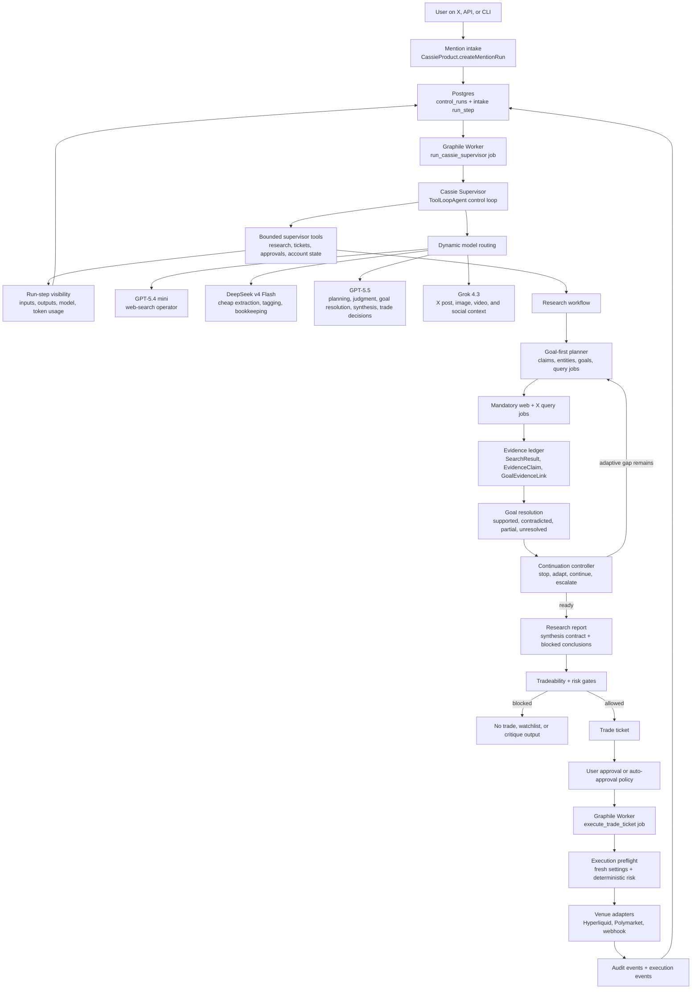

# Cassie

Cassie is an X-native trading research and ticketing agent. A mention creates a durable control-plane run, a Graphile Worker supervisor drives bounded AI tools, and approved trade tickets are handed to the execution worker.

Cassie can reason with AI, but she does not directly place orders.

## Agent Architecture



Runtime shape:

- Intake is durable first: every mention becomes a `control_run` before the supervisor starts.
- The supervisor is the control plane: it calls bounded tools and writes visible `run_steps`.
- Research is query-job driven: web and X searches produce an evidence ledger before synthesis.
- Cheap models handle extraction and bookkeeping; GPT-5.5 handles analyst judgment and trade decisions.
- Ticket creation is downstream of research, tradeability checks, approval policy, and deterministic risk.

## Run

```bash
npm install
npm run db:migrate
npm run dev
```

Dashboard:

```text
http://localhost:3000/dashboard
```

## Configuration

Copy `.env.example` to `.env` and set:

```text
DATABASE_URL
CASSIE_API_TOKEN
OPENAI_API_KEY
OPENROUTER_API_KEY
XAI_API_KEY
EXECUTION_WEBHOOK_URL
```

Missing database, AI/search, or execution credentials fail clearly. Cassie does not downgrade semantic routing, research, persistence, or execution into local keyword behavior or fake fills.

Run the worker in a second terminal:

```bash
npm run worker
```

## API

Create or update user settings:

```bash
curl -X POST http://localhost:3000/api/settings \
  -H "Content-Type: application/json" \
  -d '{
    "userId": "user_1",
    "walletAddress": "0x0000000000000000000000000000000000000000",
    "allowedVenues": ["hyperliquid", "polymarket"],
    "allowedAssets": ["SOL"],
    "defaultTradeSizeUsd": 50,
    "maxTradeSizeUsd": 100,
    "maxDailyLossUsd": 100,
    "minConfidence": 0.75,
    "maxSpreadBps": 50,
    "maxSlippageBps": 100,
    "maxPositionUsd": 1000,
    "autoTradeEnabled": false
  }'
```

Create a queued mention run:

```bash
curl -X POST http://localhost:3000/api/mentions \
  -H "Authorization: Bearer $CASSIE_API_TOKEN" \
  -H "Content-Type: application/json" \
  -d '{
    "userId": "user_1",
    "userCommand": "@Cassie get me in",
    "sourcePost": {
      "platform": "x",
      "postId": "post_1",
      "url": "https://x.com/example/status/post_1",
      "authorHandle": "example",
      "authorName": "Example",
      "text": "Solana ETF approval is basically inevitable now. Market is asleep.",
      "createdAt": null
    }
  }'
```

Inspect a run:

```bash
npm run cli -- control-run RUN_ID --json
```

Approve a ticket:

```bash
curl -X POST http://localhost:3000/api/tickets/TICKET_ID/approve \
  -H "Authorization: Bearer $CASSIE_API_TOKEN" \
  -H "Content-Type: application/json"
```

Process one queued execution job:

```bash
curl -X POST http://localhost:3000/api/execution/process \
  -H "Authorization: Bearer $CASSIE_API_TOKEN" \
  -H "Content-Type: application/json"
```

Inspect state:

```bash
curl http://localhost:3000/api/state
```

## Product Surface

Implemented:

- AI intent routing for `think`, `critic`, `trade`, and `countertrade`
- AI thesis and inverse-thesis extraction
- Goal-first research with query jobs, OpenAI web search, Grok X search, evidence ledgers, and goal resolutions
- Hyperliquid and Polymarket market-data connectors
- AI market selection from real connector candidates
- Deterministic risk checks
- Trade-ticket creation
- Approval endpoint
- Graphile Worker supervisor and execution jobs
- Drizzle/Postgres persistence for mentions, control runs, run steps, research reports, tickets, execution jobs, and audit events
- Dashboard for pending tickets, runs, and audit trail

Not included:

- Hosted database migrations
