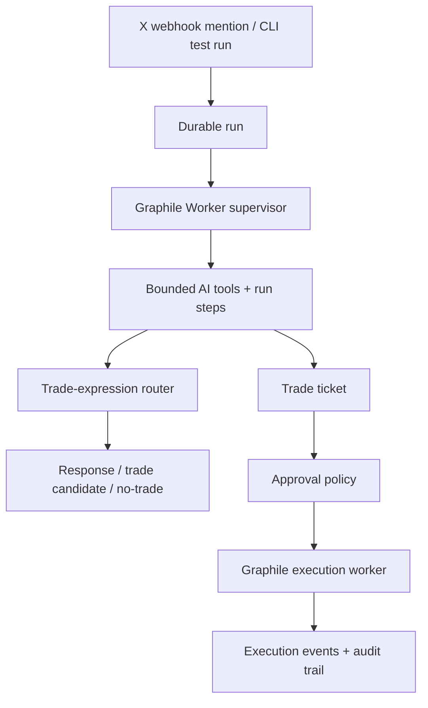

# Cassie

Cassie is an X-native trade-expression and ticketing agent. An X webhook mention or CLI test run creates a durable run, a Graphile Worker supervisor drives bounded AI tools, and trade tickets are handed to the execution worker.

Cassie can reason with AI, but she does not directly place orders.

## Agent Architecture



Runtime shape:

- Intake is durable first: every mention or CLI test becomes a `control_run` before the supervisor starts.
- The supervisor drives the run: it calls bounded tools and writes visible `run_steps`.
- Cassie treats the source post as raw verifiable signal, frames the opportunity, generates trade expressions, searches supported venues, ranks the cleanest real expression, and finalizes a ticket or no-trade.
- DeepSeek handles cheap extraction, bookkeeping, analyst judgment, and trade decisions.
- Ticket creation is downstream of market fit and uses the user's configured default trade size.
- Full supervisor and model-routing details live in `architecture.md`.

## Run

```bash
npm install
npm run db:migrate
cassie settings:set
cassie run
```

## Configuration

Copy `.env.example` to `.env` and set:

```text
DATABASE_URL
DEEPSEEK_API_KEY
OPENAI_API_KEY
GEMINI_API_KEY
XAI_API_KEY
```

Missing database, AI, market, or execution credentials fail clearly. Cassie does not downgrade semantic routing, persistence, or execution into local keyword behavior or fake fills.

Run the worker in a second terminal:

```bash
npm run worker
```

Register `https://yourdomain.com/api/x/webhook` with X Account Activity webhooks and subscribe the Cassie X account. The webhook endpoint handles CRC checks and verifies `x-twitter-webhooks-signature` with `X_CONSUMER_SECRET`.

Set `NEXT_SERVER_ACTIONS_ENCRYPTION_KEY` before building hosted images so rebuilt containers share a stable Next Server Actions key. Generate it with:

```bash
openssl rand -base64 32
```

Register the Telegram bot webhook for onboarding `/start` messages:

```bash
curl -X POST "https://api.telegram.org/bot$TELEGRAM_BOT_TOKEN/setWebhook" \
  -H "Content-Type: application/json" \
  -d '{"url":"https://yourdomain.com/api/telegram/webhook","allowed_updates":["message"],"secret_token":"'"$TELEGRAM_WEBHOOK_SECRET_TOKEN"'"}'
```

## Operate Cassie

Enqueue Cassie from the CLI:

```bash
cassie run --post "Solana ETF approval is basically inevitable now. Market is asleep."
```

Inspect an existing run:

```bash
cassie control-run RUN_ID --json
```

## Current Test Surface

Implemented:

- Single-loop AI supervisor for trade-expression routing
- Opportunity framing for raw verifiable social signals
- AI trade-expression generation and ranking
- Polymarket market discovery using SDK public search and CLOB surfaces
- Hyperliquid and Polymarket adapters over real connector candidates
- Trade-ticket creation
- Graphile Worker supervisor and execution jobs
- Drizzle/Postgres persistence for mentions, control runs, run steps, tickets, execution jobs, and audit events
- CLI inspection for tickets, runs, and audit trail

Not included:

- Hosted database migrations
